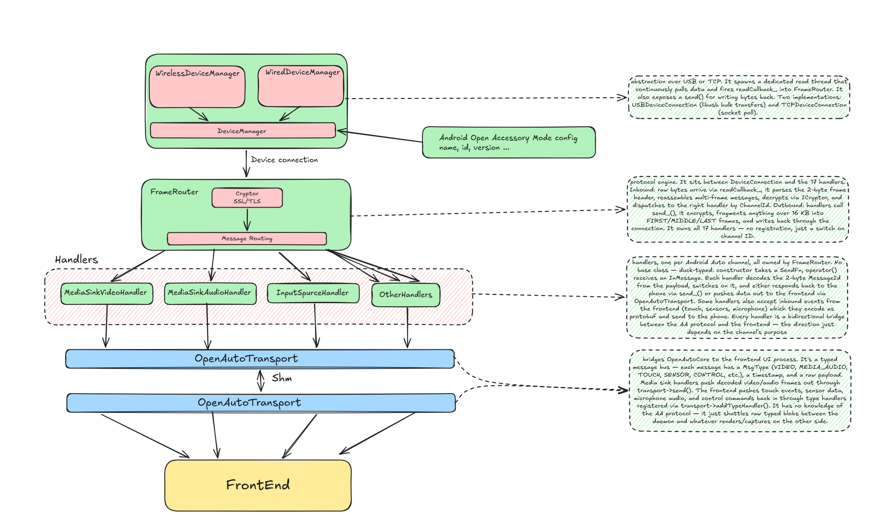

# Architecture Brief

Overview of the core subsystems: DeviceManager, DeviceConnection, FrameRouter, Handlers, and OpenAutoTransport.

## Layers

| Layer | Brief | Details |
|---|---|---|
| **DeviceManager** | Polls every 100ms for USB hotplug and BT/WiFi events. Wraps `USBDeviceManager` and `WirelessDeviceManager`. When a device is ready, fires `onDeviceReady(connection)`. | [DeviceManager.md](DeviceManager.md) |
| **DeviceConnection** | Byte-stream abstraction over USB or TCP. Spawns a dedicated read thread that pushes data into FrameRouter via `readCallback_`. Two implementations: `USBDeviceConnection` (libusb bulk) and `TCPDeviceConnection` (socket poll). | [DeviceConnection.md](DeviceConnection.md) |
| **FrameRouter** | Protocol engine between DeviceConnection and the 17 handlers. Parses AA frame headers, reassembles multi-frame messages, decrypts via ICryptor, dispatches by ChannelId. Outbound: encrypts, fragments >16 KB, writes back. | [FrameRouter.md](FrameRouter.md) |
| **Handlers** | 17 handlers, one per AA channel, all owned by FrameRouter. Duck-typed (no base class). Each is a bidirectional bridge between the AA protocol and the frontend — direction depends on the channel's purpose. | [Handlers.md](Handlers.md) |
| **OpenAutoTransport** | IPC bridge to the frontend UI process. Typed message bus (`MsgType` + timestamp + payload). Media sinks push video/audio out; frontend pushes touch, sensor, microphone, control events back in. | [OpenAutoTransport.md](OpenAutoTransport.md) |

## Data Flow

Once `DeviceManager` establishes a connection, the session is entirely **callback-driven** by the device's read thread — the main loop's 100ms poll is only for device discovery.

**Inbound (phone → frontend):** DeviceConnection read thread → FrameRouter (parse, decrypt, dispatch) → Handler → OpenAutoTransport → Frontend

**Outbound (frontend → phone):** Frontend → OpenAutoTransport → Handler (encode protobuf) → FrameRouter (encrypt, fragment) → DeviceConnection → device
